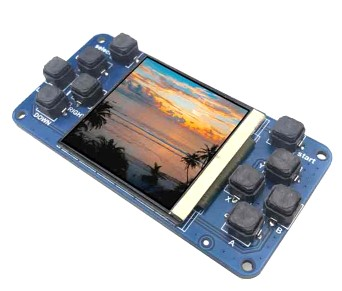

# PicoPear

**⚠️ WORK IN PROGRESS (WIP)**

Este proyecto no está terminado, contiene bugs por corregir y aún faltan juegos por adaptar que todavía no se han incluido en el repositorio.



## Descripción

PicoPear es un conjunto de configuraciones, librerías y programas para hacer funcionar una placa de expansión muy económica (en AliExpress se puede encontrar por menos de 5€) diseñada para la Raspberry Pi Pico. 

Página del fabricante:
[Raspberry Pi Pico display 1.54inch LCD 240×240 IPS 1.54 inch screen](https://spotpear.com/shop/Raspberry-Pi-Pico-RP2040-1.54inch-LCD-display-Screen-Game-ST7789.html)

Esta placa incluye una pantalla IPS de 240x240 (ST7789) y 12 botones, al estilo de una micro consola portátil.

El proyecto está enfocado al uso del firmware **Picomite 6.01** (la versión normal, no las variantes HDMI, VGA, etc.).

La interacción con la placa se realiza a través de la terminal/consola serie que expone Picomite mediante USB. Desde allí se accede al prompt de MMBasic para configurar y ejecutar comandos, al menos durante la configuración inicial. Incluye programas propios y adaptaciones de juegos de otros autores para este hardware específico.

## Motivación

Seamos sinceros: la placa en cuestión no tiene mucho que ofrecer y hay opciones mucho mejores. Sin embargo, como la tenía por aquí, decidí hacer algo con ella para darle una utilidad.

Aunque el esfuerzo pueda parecer absurdo, es un entretenimiento para mis ratos libres. No le voy a dedicar demasiado tiempo, por lo que es posible que el repositorio se quede parado durante temporadas sin evolucionar. Lo publico en GitHub porque seguramente habrá mucha gente que, como yo, compró esta placa por impulso y no sabe qué hacer con ella.

## Estructura del Repositorio

- [docs/](docs/): Información técnica de la placa y configuración del display.
- [flash-storage/](flash-storage/): Programas y juegos en MMBasic. Estos archivos deben almacenarse en la flash interna de la Pico (unidad `A:` en Picomite).
- [padlib/](padlib/): Una pequeña librería reutilizable en MMBasic para configurar los pines GPIO y facilitar la lectura del estado de los botones. Es la base de todos los programas del repo.

## Instalación del Bootloader (`autorun.bas`)

El archivo [flash-storage/autorun.bas](flash-storage/autorun.bas) actúa como un pequeño bootloader que busca y lanza automáticamente [flash-storage/menu.bas](flash-storage/menu.bas).

Para instalarlo y que arranque automáticamente al encender o resetear la Pico, sigue estos pasos desde la consola de MMBasic:

1. Carga el programa:
   
   ```mmbasic
   LOAD "autorun.bas"
   ```

2. Guárdalo en el espacio dedicado de la flash:
   
   ```mmbasic
   FLASH OVERWRITE 1
   ```

3. Habilita el autoarranque:
   
   ```mmbasic
   OPTION AUTORUN 1
   ```

## Licencia

Este proyecto se distribuye bajo la licencia **LQTSC** (haz Lo Que Te Salga de los Cojones con el código).
